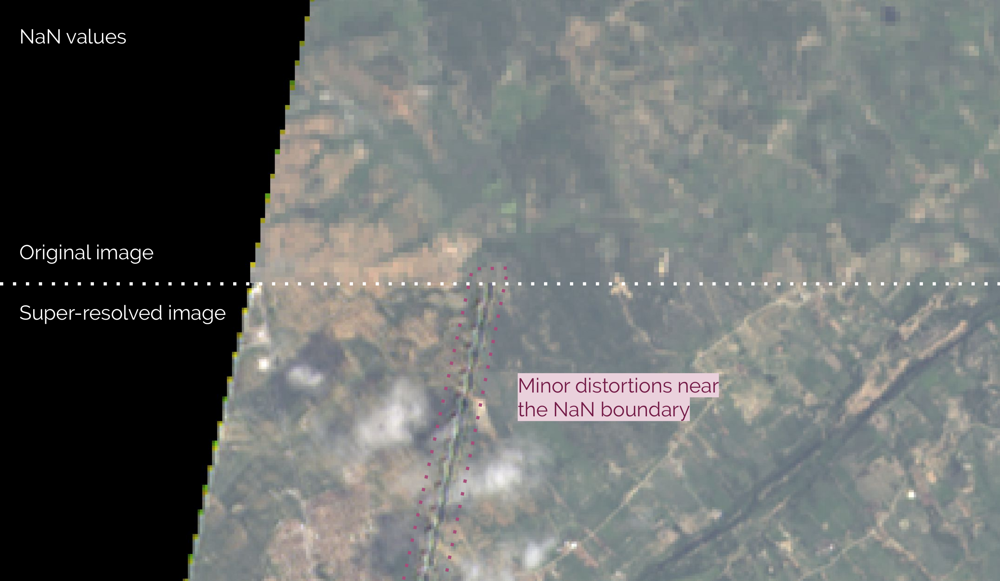

# Additional notes

This file gathers additional information on several topics.

**Table of Contents**

* [Satellites](#satellites)
	* [Sentinel 2](#sentinel-2)
	* [LandSat 8](#landsat-8)
	* [VIIRS](#viirs)
	* [MODIS](#modis)
* [Others](#others)
	* [Data processing](#data-processing)


## Satellites

If you want to have a brief overview of the data of the different satellites we recommend the [CREODIAS](https://discovery.creodias.eu/dataset) online viewer.


### Sentinel 2

In the case of Sentinel 2, we upsample 60m and 20m resolution bands to 10m resolution. Band B10 at 60m is to noisy and is not super-resolved.

| Resolutions | Band names                            |
|:-----------:|---------------------------------------|
|     10m     | 'B4', 'B3', 'B2', 'B8'                |
|     20m     | 'B5', 'B6', 'B7', 'B8A', 'B11', 'B12' |
|     60m     | 'B1', 'B9'                            |

**Available processing levels for super-resolution**

* Level 1C:
[Sample - Level 1C](https://cephrgw01.ifca.es:8080/swift/v1/satellite_samples/S2A_MSIL1C_20170608T105651_N0205_R094_T30TWM_20170608T110453.SAFE.zip
)

* Level 2A:
[Sample - Level 2A](https://cephrgw01.ifca.es:8080/swift/v1/satellite_samples/S2A_MSIL2A_20190123T040041_N0211_R004_T48UXF_20190123T061251.SAFE.zip)

**References**

* [Download the data](https://scihub.copernicus.eu/dhus/#/home)

### LandSat 8

In the case of LandSat 8 we upsample low resolution 30m bands to 15m resolution.

| Resolutions | Band names                                                   |
|:-----------:|--------------------------------------------------------------|
|     15m     | 'B8'                                                         |
|     30m     | 'B1', 'B2', 'B3', 'B4', 'B5', 'B6', 'B7', 'B9', 'B10', 'B11' |

A tilepath of a single observation must be pointing to a folder grouping all the files belonging this single observation, like the following:

```bash
landsat8_tiles/
├── LC80200362019035LGN00
│   ├── LC08_L1TP_020036_20190204_20190221_01_T1_ANG.txt
│   ├── LC08_L1TP_020036_20190204_20190221_01_T1_B10.TIF
│   ├── LC08_L1TP_020036_20190204_20190221_01_T1_B11.TIF
│   ├── LC08_L1TP_020036_20190204_20190221_01_T1_B1.TIF
│   ├── LC08_L1TP_020036_20190204_20190221_01_T1_B2.TIF
│   ├── LC08_L1TP_020036_20190204_20190221_01_T1_B3.TIF
│   ├── LC08_L1TP_020036_20190204_20190221_01_T1_B4.TIF
│   ├── LC08_L1TP_020036_20190204_20190221_01_T1_B5.TIF
│   ├── LC08_L1TP_020036_20190204_20190221_01_T1_B6.TIF
│   ├── LC08_L1TP_020036_20190204_20190221_01_T1_B7.TIF
│   ├── LC08_L1TP_020036_20190204_20190221_01_T1_B8.TIF
│   ├── LC08_L1TP_020036_20190204_20190221_01_T1_B9.TIF
│   ├── LC08_L1TP_020036_20190204_20190221_01_T1_BQA.TIF
│   └── LC08_L1TP_020036_20190204_20190221_01_T1_MTL.txt
└── LC80480242019023LGN00
    ├── LC08_L1TP_048024_20190123_20190205_01_T1_ANG.txt
    ├── LC08_L1TP_048024_20190123_20190205_01_T1_B10.TIF
    ├── ...

```
**Available processing levels for super-resolution**

* Level 1C:
[Sample - Level 1C](https://cephrgw01.ifca.es:8080/swift/v1/satellite_samples/LC82150652019025LGN00.zip)

**References**

* [Download the data](https://earthexplorer.usgs.gov/)


### VIIRS

In the case of VIIRS we upsample the 750m resolution bands to 350m resolution.

| Resolutions | Band names                                             |
|:-----------:|--------------------------------------------------------|
|     375m    | 'I1', 'I2', 'I3'                                       |
|     750m    | 'M1', 'M2', 'M3', 'M4', 'M5', 'M7', 'M8', 'M10', 'M11' |

**Available processing levels for super-resolution**

* Level 2 - VNP09 Dataset:
[Sample - VNP09](https://cephrgw01.ifca.es:8080/swift/v1/satellite_samples/VNP09.A2019021.2142.001.2019035204543.zip)

:warning: There is a [minor bug](https://github.com/deephdc/satsr/blob/master/satsr/satellites/viirs.py#L130-L151) when setting the geotransform and geoprojection of the new superresolved VIIRS images. If anyone has experience with GDAL and/or VIIRS imagery, we are happy to accept PR patches!

**References**

* [Download the data](https://ladsweb.modaps.eosdis.nasa.gov/search/)
* [Introduction to VIIRS data](http://rammb.cira.colostate.edu/projects/npp/Beginner_Guide_to_VIIRS_Imagery_Data.pdf)
* [VIIRS Surface Reflectance User’s Guide](https://viirsland.gsfc.nasa.gov/PDF/VIIRS_Surf_Refl_UserGuide_v1.3.pdf)
* [VIIRS Level 1B User's Guide](https://ladsweb.modaps.eosdis.nasa.gov/missions-and-measurements/viirs/NASA_VIIRS_L1B_UG_May_2018.pdf)


### MODIS

The MODIS instrument is operating on both the Terra and Aqua spacecraft.  It has a viewing swath width of 2,330 km and views the entire surface of the Earth every one to two days. Its detectors measure 36 spectral bands between 0.405 and 14.385 µm, and it acquires data at three spatial resolutions -- 250m, 500m, and 1,000m.

Thefore in the case of MODIS we upsample the 500m and 1km resolution bands to 250m resolution.

| Resolutions | Band names                                                                                                                                                                                                     |
|:-----------:|----------------------------------------------------------------------------------------------------------------------------------------------------------------------------------------------------------------|
|     250m    | '250_B1', '250_B2'                                                                                                                                                                                             |
|     500m    | '500_B1', '500_B2', '500_B3', '500_B4', '500_B5', '500_B6', '500_B7'                                                                                                                                           |
|    1000m    | '1000_B1', '1000_B2', '1000_B3', '1000_B4', '1000_B5', '1000_B6', '1000_B7', '1000_B8', '1000_B9', '1000_B10', '1000_B11', '1000_B12', '1000_B13', '1000_B14', '1000_B15', '1000_B16', '1000_B26', '1000_B3PR' |

**Available processing levels for super-resolution**

* Level 2 - MOD09 Dataset:
[Sample - MOD09](https://cephrgw01.ifca.es:8080/swift/v1/satellite_samples/MOD09.A2019021.1710.006.2019023051303.zip)

:warning: There is a [minor bug](https://github.com/deephdc/satsr/blob/master/satsr/satellites/modis.py#L149-L170) when setting the geotransform and geoprojection of the new superresolved MODIS images. If anyone has experience with GDAL and/or MODIS imagery, we are happy to accept PR patches!

**References**

* [MODIS data](https://modis.gsfc.nasa.gov/data/)
* [MODIS Bands specifications](https://modis.gsfc.nasa.gov/about/specifications.php)
* [MOD02 (Level 1B) - MODIS Calibrated Radiances User Guide](https://mcst.gsfc.nasa.gov/sites/default/files/file_attachments/M1054E_PUG_2017_0901_V6.2.2_Terra_V6.2.1_Aqua.pdf)
* [MOD09 (Level 2A) - MODIS  Surface Reflectance User Guide](http://modis-sr.ltdri.org/guide/MOD09_UserGuide_v1.4.pdf)


## Others

### Data processing

All images are rescaled to be in the range [0, 1] (and rescaled back to the original range when saved during test).

Fill_values (or NaNs) are assigned to zero during processing. This can cause minor distortions in some satellites (like LandSat8) for values close to the NaN's area. We are happy to hear ideas on how to avoid this wihtout adding to much complexity to the pipeline (eg. mirror neighbouring pixels to replace NaN's instead of using zeros).


**Figure:** *Example of a distortion near the NaN boundary for a LandSat 8 image.*